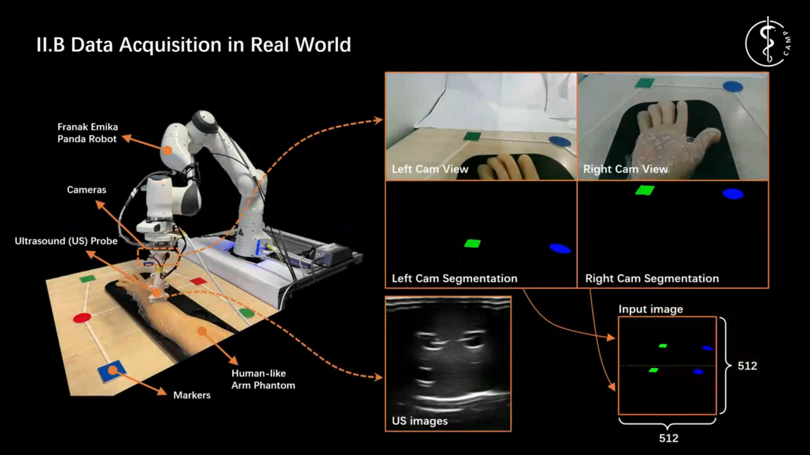

<!--
 * @Author: Dianye dianye.huang@tum.de
 * @Date: 2024-06-14 20:28:11
 * @LastEditors: Dianye dianye.huang@tum.de
 * @LastEditTime: 2024-06-15 17:17:44
 * @FilePath: /FreehandUS/README.md
 * @Description: 
    * 
-->
# Improving Probe Localization for Freehand 3D Ultrasound using Lightweight Cameras

## 1. Introduction
Ultrasound (US) probe localization relative to the examined subject is essential for freehand 3D US imaging, which offers significant clinical value due to its affordability and unrestricted field of view. However, existing methods often rely on expensive tracking systems or bulky probes, while recent US image-based deep learning methods suffer from accumulated errors during probe maneuvering. To address these challenges, this study proposes a versatile, cost-effective probe pose localization method for freehand 3D US imaging, utilizing two lightweight cameras. To eliminate accumulated errors during US scans, we introduce PoseNet, which directly predicts the probe's 6D pose relative to a preset world coordinate system based on camera observations. 

<div align="center">

</div>

## 2. Video Demo
[](https://www.youtube.com/watch?v=qGfVsSUhEJM)

## 3. Repository description

### 3.1 Estimation_networks
Implementattion of the network sturcture.
<div align="center">

</div>


### 3.2 Realworld settings
Design the camera holder and decide the how to install the camera, which will affect the final field of view. Then, write some codes to stream the images and get the intrinsic/extrinsic and DFOV of the cameras. This section includes:

- Dual camera images streaming
  - realworld_settings/multicam_cfg.py
  - realworld_settings/multicam_stream.py
  - realworld_settings/multicam_test.py

- camera intrinsic and extrinsic parameters calibration, the calibration boards can be found in "assets/calibration_board". To generate the calibration board, we suggest: https://calib.io/pages/camera-calibration-pattern-generator .
  - realworld_settings/cam_intrinsic_cali.py
  - realworld_settings/eyeinhand_utils.py & realworld_settings/eyeinhand_cali.py

### 3.3 Simulation settings
Simulation images and pose pair collection, the simulation scene in coppeliaSim can be found in "assets/coppeliaSim_ttt". To synthesize a dataset in the simulation environment, we should first synchronize the calibration results into the simulation settings and then write a script to communicate with coppeliasim.
- Preliminaries
  
  - copy and paste some files
       - "remoteApi.so" if you are using ubuntu 20.04
       - sim.py
       - simConst.py

  - open coppeliaSim
  entering the following commands, and import the scene (*.ttt) in the "vrep_sim/scenes/xxxx" into the CoppeliaSim 
      ```
      $ cd Downloads/CoppeliaSim_Edu_V4_6_0_rev18_Ubuntu20_04/
      $ ./coppeliaSim.sh 
      ```

  - coppeliaSim setting
  define an object as access to the python script. Associate a "Child script" to this object, choose "Non-Threading", use "Lua" type, paste "simRemoteApi.start(19999)" into the "function sysCall_init()".

  - start communication
  Start running coppeliaSim first, and then run the python script.
  

## 4. Citation
If you found this work interesting and adopted part of it to your own research, or if this work inspires your research, you can cite our paper by:

```
@inproceedings{posenet25,
  title     = {Improving Probe Localization for Freehand 3D Ultrasound using Lightweight Cameras},
  author    = {Dianye, Huang and
               Nassir, Navab and
               Zhongliang, Jiang},
  booktitle = {IEEE International Conference on Robotics and Automation (ICRA)},
  year = {2025}
}
```